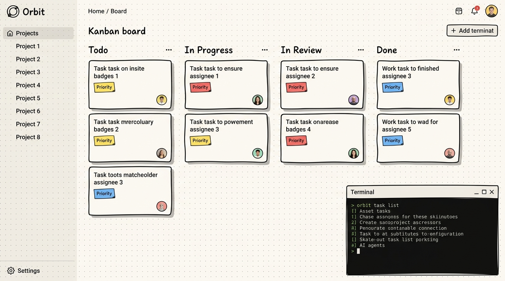
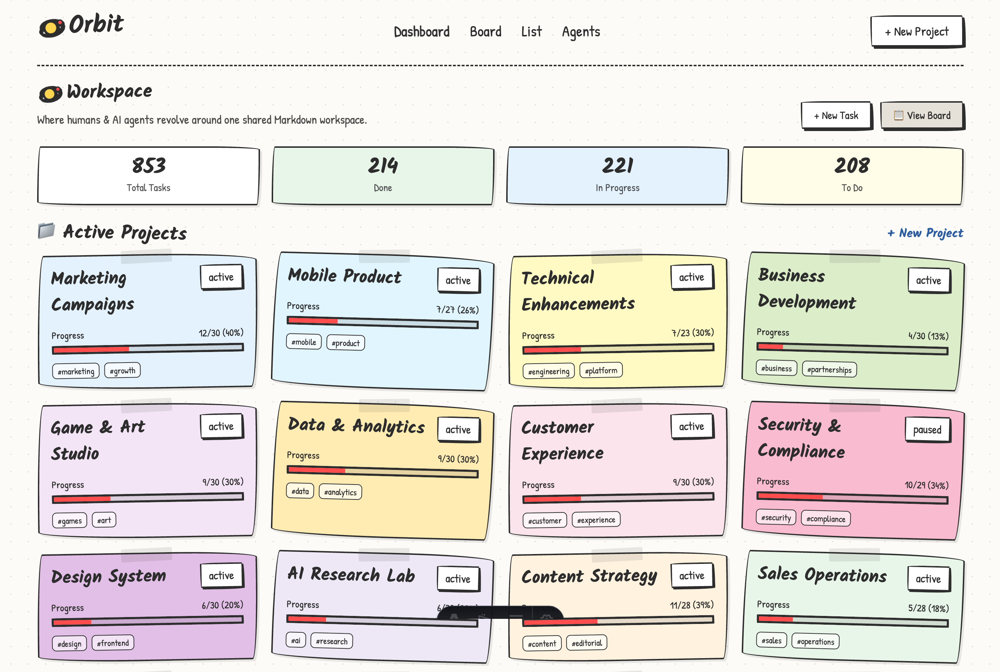
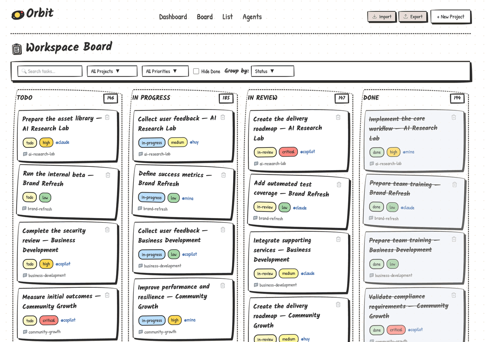
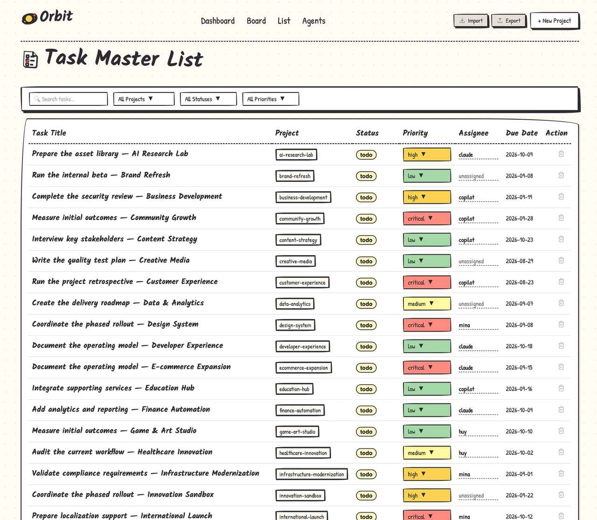
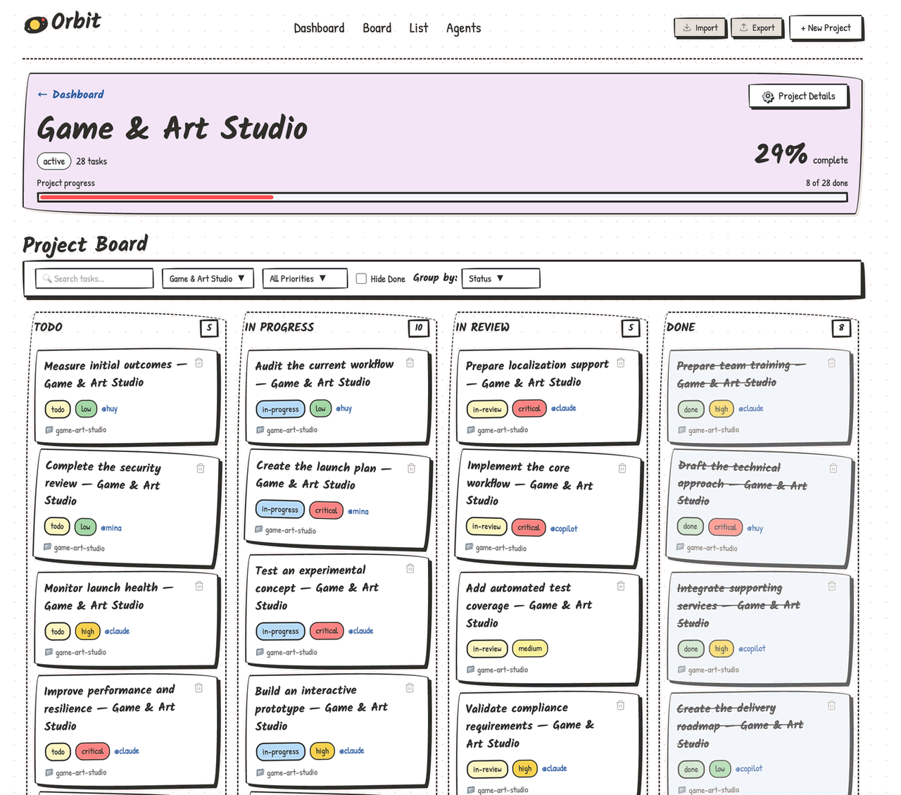
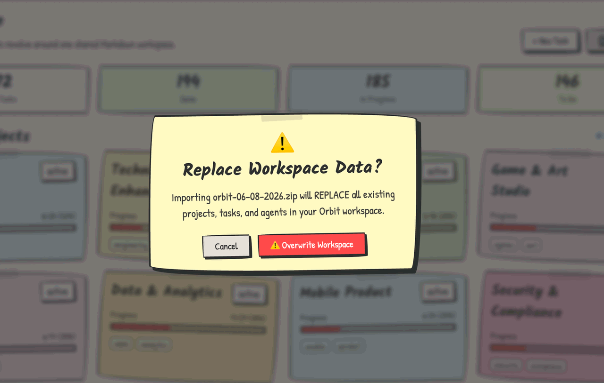

<div align="center">

<br />



<br />

# 🪐 Orbit

**The workspace that keeps you at the center of your AI team.**

A local-first home for you and the agents working around you. See what they are doing, guide what happens next, and keep the whole story in plain Markdown files you own.

<br />

[](https://orbit.nvkhuy.com)
[](https://github.com/nvkhuy/orbit/stargazers)
[](LICENSE)

[](https://astro.build/)
[](https://preactjs.com/)
[](https://www.markdownguide.org/)
[](#-the-story-behind-orbit)
[](#-working-with-ai-agents)
[-9c27b0?style=flat-square)](#-the-source-of-truth)

<br />

**[Live Demo](https://orbit.nvkhuy.com)** · **[Quick Start](#-quick-start)** · **[Why Orbit?](#-why-orbit)** · **[Screenshots](#-see-orbit-in-action)** · **[CLI](#-cli)** · **[For AI Agents](#-working-with-ai-agents)** · **[Contributing](#-contributing)**

<br />

</div>

---

## 💭 The Story Behind Orbit

Most project tools were built for a world where work meant coordinating with other people. You created a workspace, invited a team, shared pages, assigned tasks, and held meetings to keep everyone aligned. Tools like Notion made that kind of collaboration far better.

But AI is changing the shape of a team.

One person can now work with several agents at once: one writing code, another researching, another reviewing, and another preparing the next task. The ability to produce work is no longer the only constraint. The harder problem is staying aware of everything happening around you.

Without a shared view, the work scatters across chat threads, terminals, branches, and half-finished plans. Agents can be busy everywhere while you slowly lose the thread. What is being worked on? Why did an agent make that decision? What is blocked? What needs your judgment now?

That is the problem Orbit is trying to solve.

The name is a picture of how I believe this relationship should work. **You are at the center.** Your goals, taste, and judgment provide the gravity. Agents move around that center—picking up tasks, making progress, and returning with results. Orbit gives you one place to observe that movement and decide where the work should go next.

This is also why Orbit is local-first by design. A workspace for you and your agents should begin on your machine, close to the work itself. It should not require an account, a hosted service, or a company workspace. Projects, tasks, decisions, and agent logs live in ordinary Markdown files. Both you and your agents can read them, Git can remember them, and no platform gets to hold them hostage.

You can still host Orbit and invite other people when the project grows. The difference is that collaboration is a choice, not the starting requirement. Orbit begins as a private workspace for one person and the agents helping them, then expands only when that person wants it to.

The hand-drawn interface comes from the same belief. As software becomes more autonomous, I want the place where I direct it to feel unmistakably human—more like a notebook on my desk than a control panel built for a corporation.

Orbit is my attempt to make AI collaboration easier to see, easier to guide, and easier to own. Agents may do more of the work, but the human should never disappear from the center of it.

*— Huy*

---

## ✨ See Orbit in Action

### 📊 Workspace Dashboard

<div align="center">

<br />
<sub><strong>Your command center.</strong> Monitor every project's health at a glance — task counts, progress bars, and pastel-colored project cards that feel like sticky notes on your desk.</sub>
</div>

<br />

### 📋 Kanban Board

<div align="center">

<br />
<sub><strong>Drag, drop, done.</strong> A full interactive Kanban board with filters, search, grouping by status/project/priority/assignee — all in that signature hand-drawn style.</sub>
</div>

<br />

### 📝 Task List & Project Views

<table>
  <tr>
    <td width="50%" align="center">
      
      <br />
      <strong>Task Master List</strong><br />
      <sub>Every task across your workspace in one compact, searchable, filterable table.</sub>
    </td>
    <td width="50%" align="center">
      
      <br />
      <strong>Project Deep-Dive</strong><br />
      <sub>Focus on a single project — track progress, manage tasks, and see the big picture.</sub>
    </td>
  </tr>
</table>

### 📦 Import & Export — Zero Lock-in

<div align="center">

<br />
<sub><strong>Your data is yours.</strong> Export everything as a ZIP of Markdown files. Import it back anytime. No vendor lock-in. Ever.</sub>
</div>

---

## 🚀 Why Orbit?

<table>
  <tr>
    <td width="50%">

### 🧑 You Remain in Charge

Orbit is organized around your goals and decisions. Agents can carry out the work, but you keep the view of the whole project and decide where it goes next.

### 👁️ Agent Work You Can See

See what every agent has claimed, what is moving, what is blocked, and where your attention is needed—without reconstructing the story from separate chat sessions.

### 📓 Personal by Default

No account, central server, or organization setup. Orbit starts as a private workspace on your machine and can be hosted when you are ready to bring in other people.

</td>
<td width="50%">

### 📝 One Shared Source of Truth

You and your agents work from the same Markdown files. Tasks, status changes, context, and decisions stay together instead of being trapped inside separate conversations.

### 🌿 Yours All the Way Down

There is no proprietary database. Open your workspace in any editor, track it with Git, process it with scripts, or move it somewhere else. Your history remains yours.

### ✏️ Deliberately Human

The soft colors, imperfect borders, and notebook-like cards are a reminder that the system serves a person—not the other way around.

</td>
  </tr>
</table>

> **TL;DR** — Other workspaces begin with a group of people. Orbit begins with you and the agents working around you: local by default, observable in one place, and entirely under your control.

---

## 🏁 Quick Start

### Prerequisites

- **Node.js** 22.12.0 or newer
- **npm**

### 3 commands to joy

```bash
git clone https://github.com/nvkhuy/orbit.git
cd orbit
npm install && npm run dev
```

Open **[http://localhost:4321](http://localhost:4321)** and feel the sketch.

### Using Make

```bash
make run       # Start the dev server
make test      # Seed a rich demo workspace (30 projects, 600+ tasks)
make reset     # Clear all workspace data (⚠️ destructive)
```

> [!WARNING]
> `make reset` deletes all `.md` files from `src/content/projects`, `src/content/tasks`, and `src/content/agents`. Back up or commit first.

---

## 📐 What You Can Do

| Area | What's Inside |
| :--- | :--- |
| **Dashboard** | Project health cards, task metrics, progress bars, recent activity |
| **Board** | Drag-and-drop Kanban with grouping by status, project, priority, or assignee |
| **List** | Searchable, filterable table of every task across all projects |
| **Projects** | Create projects with status, priority, color, tags, and progress tracking |
| **Tasks** | Full editing — title, status, priority, assignee, due date, tags, Markdown notes |
| **Agents** | Agent profiles living alongside your work — context for AI collaborators |
| **Import/Export** | ZIP-based backup and restore — your data leaves when you leave |
| **CLI** | Create, query, update, and summarize workspace data from your terminal |

---

## 🗂️ The Source of Truth

All data lives as Markdown with YAML frontmatter:

```
src/content/
├── agents/          # 🤖 AI agent profiles
│   └── <name>.md
├── projects/        # 📁 Project definitions
│   └── <slug>.md
└── tasks/           # ✅ Individual tasks
    └── <project>--<task>.md
```

### A task looks like this:

```yaml
---
title: "Add dark mode support"
project: "design-system"
status: "in-progress"       # todo | in-progress | in-review | done
priority: "high"            # low | medium | high | critical
assignee: "claude"
tags: [frontend, ui, accessibility]
due: 2026-08-15
order: 200
created: 2026-08-05
updated: 2026-08-05
---

## Notes

Implement CSS custom properties for theme switching.
Respect user's system preference with `prefers-color-scheme`.
```

That's it. No ORM. No migrations. No schema files. **Just Markdown.**

---

## 💻 CLI

Manage your workspace without opening a browser:

```bash
# Overview
orbit summary                                    # Workspace health report
orbit query "authentication"                     # Search across all content

# Projects
orbit project list                               # List all projects
orbit project create --title "Mobile App" --status active --priority high

# Tasks
orbit task list --project design-system --status todo
orbit task create --project mobile-app --title "Add offline sync" --priority high --assignee claude
orbit task update mobile-app--add-offline-sync --status in-progress
orbit task done mobile-app--add-offline-sync     # 🎉 Ship it
```

> **Pro tip:** Pipe `orbit summary` into your AI agent's context for an instant workspace briefing.

---

## 🤖 Working with AI Agents

Orbit gives every agent a clear way to work without creating a separate world you have to monitor. An agent can:

1. **Read** project and task Markdown directly from the filesystem
2. **Claim work** by setting `assignee: agent-name` and `status: in-progress`
3. **Log progress** under `## Agent Log` inside the task file
4. **Complete work** by changing status to `done`
5. **Commit changes** alongside code — because task files *are* just files

### API Endpoints

```bash
# Create a task
curl -X POST https://orbit.nvkhuy.com/api/tasks \
  -H "Content-Type: application/json" \
  -d '{"title": "Refactor API", "project": "orbit", "priority": "high", "assignee": "claude"}'

# Update a task
curl -X PATCH https://orbit.nvkhuy.com/api/tasks/orbit--refactor-api \
  -d '{"status": "in-progress"}'
```

### Agent Guidelines

Agent-specific instructions live in [`AGENTS.md`](AGENTS.md) — including the recommended color palette, frontmatter schema, and protocol for picking up and completing tasks.

> **Why this matters:** Agents often work inside isolated conversations, each with only part of the picture. Orbit gives them shared, durable context while giving you a view across all of their work. Any agent that can read and write text files can participate—no special SDK, API key, or permission setup required.

---

## 🏗️ Architecture

```
                    ┌─────────────────────────────┐
                    │    src/content/**/*.md       │
                    │    (Markdown = Database)     │
                    └──────────────┬──────────────┘
                                   │
              ┌────────────────────┼────────────────────┐
              │                    │                     │
    ┌─────────▼─────────┐  ┌──────▼──────┐  ┌──────────▼──────────┐
    │   🌐 Web App      │  │  ⌨️  CLI    │  │  🤖 AI Agents       │
    │   Astro + Preact   │  │  Commander  │  │  File I/O or API    │
    │   Islands Arch.    │  │  Node.js    │  │  Any LLM            │
    └─────────┬─────────┘  └──────┬──────┘  └──────────┬──────────┘
              │                    │                     │
              └────────────────────┼────────────────────┘
                                   │
                    ┌──────────────▼──────────────┐
                    │      🌿 Git + Filesystem    │
                    │      Version Control        │
                    │      Single Source of Truth  │
                    └─────────────────────────────┘
```

| Layer | Technology | Role |
| :--- | :--- | :--- |
| **Framework** | [Astro](https://astro.build/) | Server rendering, file-based routing, API routes |
| **Islands** | [Preact](https://preactjs.com/) | Interactive components (board, editors, modals) |
| **Parser** | [gray-matter](https://github.com/jonschlinkert/gray-matter) | Read/write YAML frontmatter in Markdown |
| **CLI** | [Commander](https://github.com/tj/commander.js) | Terminal interface for all workspace operations |
| **Storage** | Node.js `fs` | Direct filesystem — no database layer |

---

## 🛠️ Development

```bash
npm install          # Install dependencies
npm run dev          # Start local dev server at localhost:4321
npm run build        # Production build → dist/
npm run preview      # Preview production build locally
```

```bash
make test            # Seed 30 projects × ~20 tasks each (demo data)
make reset           # ⚠️ Wipe all workspace content
make update-skills   # Sync agent guidelines across claude/codex/gemini
```

### Project Structure

```
orbit/
├── cli/                  # Terminal commands (project, task, query, summary)
├── public/               # Static assets, screenshots, favicon
├── scripts/              # Workspace seeding and reset tooling
├── src/
│   ├── components/       # Astro + Preact UI components
│   ├── content/          # 📂 Projects, tasks, agents (the data)
│   ├── pages/            # Routes: dashboard, board, list, editors, API
│   └── styles/           # Global sketch design system & animations
├── AGENTS.md             # AI agent collaboration guidelines
├── Makefile              # Common workflows
└── package.json
```

---

## 🤝 Contributing

Orbit is open source and contributions are warmly welcome!

### How to contribute

1. **Fork & clone** the repo
2. **Create a branch** for your change
3. **Make the smallest coherent change** — Orbit values simplicity
4. **Run `npm run build`** to verify everything compiles
5. **Open a PR** with motivation, behavior change, and testing steps

### Guidelines

- **Preserve the sketch aesthetic** — new components should feel hand-drawn
- **Keep it local-first** — features must work with plain Markdown files
- **No database dependencies** — the filesystem is the only storage layer
- **Both UI and CLI** — new features should be accessible from both where practical

> [!TIP]
> Use `make test` to seed a rich workspace with 30 diverse projects and 600+ tasks — perfect for testing your changes at scale.

---

## 💛 Star History

If Orbit makes your day a little brighter, a ⭐ means the world.

<div align="center">

[](https://star-history.com/#nvkhuy/orbit&Date)

</div>

---

## 📄 License

Orbit is released under the [MIT License](LICENSE) — use it, fork it, make it yours.

---

<div align="center">

<br />

*Built to keep humans at the center of the work.*

**[🪐 Try Orbit →](https://orbit.nvkhuy.com)**

<br />

</div>
